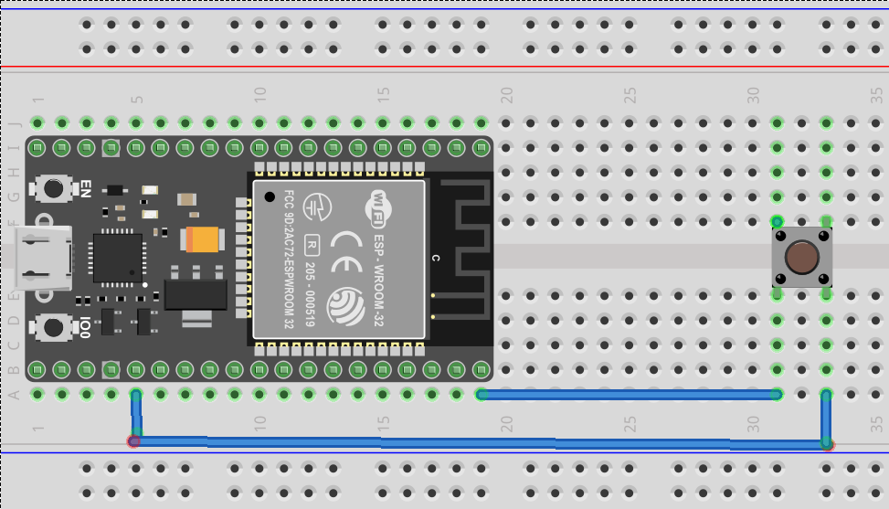

# Project-1-Alexa-Doorbell

Follow the instruction from youtube video

## Components Required
* ESP32
* Push Button
* BreadBoard

## Connections

Push Button -> P2 and GND

## Link to SmartNest
[SmartNest](https://www.smartnest.cz/)

## Circuit
